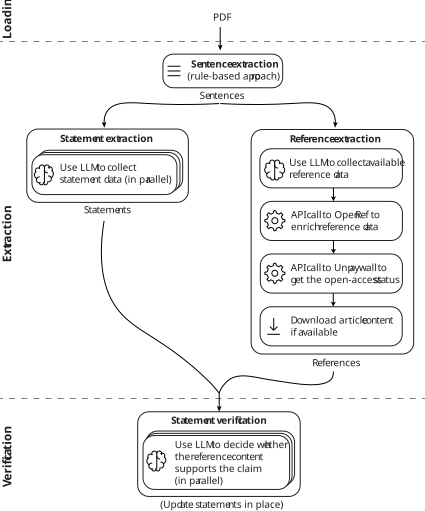

# CitationChecker

CitationChecker is a simple app that checks the veracity of claims in a scientific article against its cited references. It uses a multiagent system orchestrated by Langgraph to extract statements and references, verify each statement against its citations, and display the verification status of each claim in a React UI with explanations.

⚠️ This is a proof-of-concept implementation with many limitations discussed later. It is not intended for production use or full accuracy; the goal is to explore what multiagent systems can do for this type of task.

## Preview

Here is a preview of the app in action:

After extraction, you can explore claims seamlessly between the PDF viewer and the statement section:

You can also open each extracted reference:

## State Management and Flow

The following diagram shows the app's main states:

State management is handled with an XState state machine. The code lives in `frontend/my-app/src/statementVerificationMachine.js`. All the main logic of the app, including invoking the Langgraph graphs is directly performed on the client side in the React app. 

The main stages of the state machine are:

- `loading`: The app is loading the PDF document.
- `Extraction`: In parallel, the app extracts statements and references with two separate Langgraph graphs. The JS code for the graphs can be found in `frontend/my-app/src/graphs/statement-extraction-graph.js` and `frontend/my-app/src/graphs/reference-extraction-graph.js`. For statement extraction, we run multiple agents over sentences to detect and extract claims. For reference extraction, a single agent extracts all references and streams them to the UI.
- `Verification`: For each extracted statement, we verify it against its cited references. This runs in parallel with multiple agents, one per statement. The code for the graph can be found in `frontend/my-app/src/graphs/statement-verification-graph.js`. Each agent receives the statement and its cited references, determines whether the claim is supported, refuted, or unverified based on the references, and provides an explanation.

A version of the Python code to run the graphs without the UI can be found in `dev/statement_verification_graph.ipynb`.

In the case of an error, the state-machine transitions to an `error` state which is not shown in the diagram for simplicity.

## Known Limitations

This project is a proof-of-concept with many limitations. Fixing all these limitations would require significant effort that is not justified for this little demo. Here is a list of the main limitations and possible future improvements:

- Most scientific articles are not open access, and when they are, their content is often not easily downloadable. Fix: Some journals allow the automatic downloading of article but require an API key. By using a forward proxy, we could route requests through a server that has the necessary API keys and access rights to download the content of cited references.
- False positives statements: The statement extraction graph is very simple and may extract sentences that are not really claims. This can lead to false positives in the verification step. Fix: A sound dose of prompt engineering could probably do miracles here. We could also use a more complex graph with multiple agents and a verification step to filter out false positives.
- False negatives statements: The statement extraction graph may miss some claims, especially if they are not explicitly stated or are spread across multiple sentences. Fix: Again, prompt engineering and a more complex graph could help here. 
